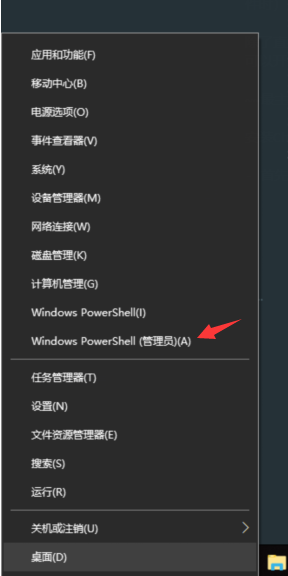
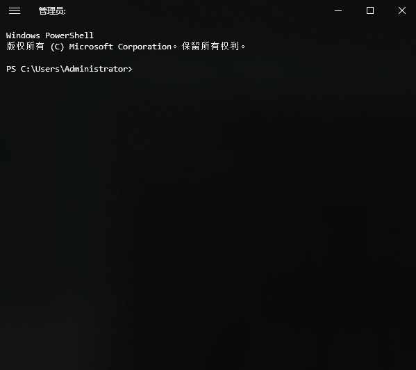
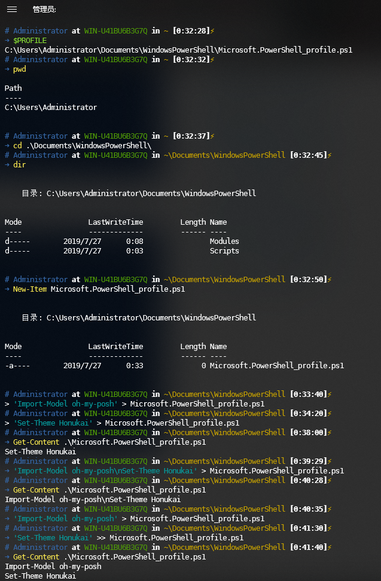
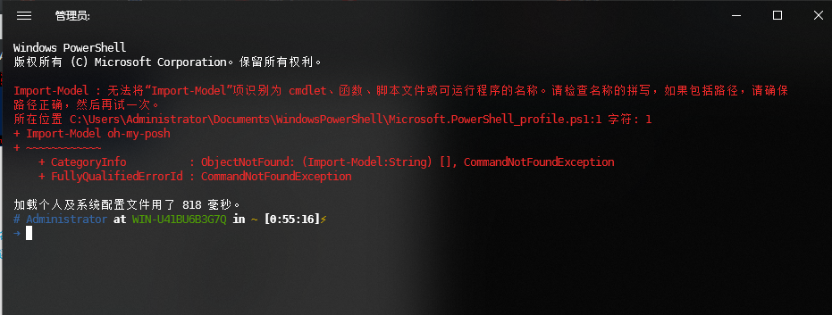

# 使用Fluent Terminal + Oh-My-Posh打造优雅的Windows终端

## 前言

说起Windows的终端大家第一印象就是傻大笨，从黑框框CMD的古老到升级的Powershell的复杂多变，大家似乎对Windows的终端充满了厌恶。我也一次次转到Linux系统（比如Ubuntu、Fedora、DeepinOS等都尝试过）但是因为很多原因没办法完全使用下去（绝对不是因为我喜欢玩游戏，哼╭(╯^╰)╮），装了Hackintosh但是不够完美（而且我的ThinkPad和Hackintosh总有一种违和感），但是又怀念我的Fedora上面漂亮的oh-my-zsh，顺便看着同学的MacBook Pro流口水，我开始上网寻找答案。


首先找到答案的是安装WSL（Windows Subsystem for Linux），我尝试安装了之后发现美观问题略有解决。但是之后发现系统隔绝还是很大的，反正就是总是报一些小错误，让人很烦。此时我不得不切换回了Powershell，开始思考他的美化问题。于是我找到了Oh-My-Posh。

在所有问题之前我要先说一个类似于Fedora里面的`dnf`或者`yum`，Ubuntu里面类似`apt`的软件包安装器一样的东西 —— Chocolatey。

**不要问我有没有用，生命不息，折腾不止！**

## Chocolatey 的安装

Chocolatey是一种软件包安装器，通过它可以集中安装、管理、更新各种各样的软件。

特别适合管理一些小众、轻量的开源软件。

可以一条命令更新全部软件，特别适合治疗自己的更新强迫症（尤其是遇上一些不能自动检查更新的软件时）。

除了直接自动化从程序官网拽安装包，自动化安装外。官方的源里面，还有一些绿化的软件、净化软件可以开袋即食。

~~最主要的是还可以装逼~~

安装Chocolatey的方式十分简单

- 首先，右键Windows徽标，出现如图所示，选择  `Windows Powershell(管理员)(A)`

    

- 然后，在命令行粘贴以下下代码

    ```powershell
    Set-ExecutionPolicy Bypass -Scope Process -Force; iex ((New-Object System.Net.WebClient).DownloadString('https://chocolatey.org/install.ps1'))
    ```

- 大功告成！

## 安装 Fluent Terminal 以及字体

### 安装

安装完chocolatey之后，安装Fluent Terminal的方法就十分简A单了

``` powershell
choco install fluent-terminal
```

如果在安装过程中提示是否安装脚本，请选择`(A)全部安装`

然后，打开你的开始菜单，就可以找到 Fluent Terminal 啦。第一次打开是这个样子的：



这时，关掉你的蓝框框吧，开始用 Fluent Terminal 吧！

### 字体配置

Oh-My-Posh 支持 Powerline 字体，才能达到上图那样漂亮的样子，先去 [PowerLine的Github仓库](https://github.com/powerline/fonts) 下载 `DejavuSansMono`吧，貌似这个才是唯一支持的字体（反正我用的这个）。

安装完字体后，具体的设置是点击右上角的三个横杠 - 设置 - 终端 - 字体，选择`DejavuSansMono`即可。

## 安装 Posh 和 Oh-My-Posh

- 首先执行这行代码，解决 Posh 依赖，并安装 Posh-Git

    ```powershell
    Install-Module posh-git -Scope CurrentUser
    ```

    如果提示安装 NuGet，就回车；如果此前没有开启执行任意脚本，此处也会提示执行脚本。如果没有权限执行脚本，可能需要先执行 （一切正常就不用执行）
    
    ```powershell
    Set-ExecutionPolicy Bypass。
    ```

- 然后安装 Oh-My-Posh 本身

    ```powershell
    Install-Module oh-my-posh -Scope CurrentUser
    ```

    

    注：所有提示 `不受信任的存储库` 选项都选 `[A]全是(A)`，后文不再赘述。

- 此时我们的 Oh-My-Posh 已经安装成功啦，让我们激活它

    ```powershell
    Import-Module oh-my-posh
    ```

    之后就会发现终端发生一些变化，**但是这只是暂时的**，重启终端就会消失。我们需要做一些改变，就像配置 `zsh` 的 `.zshrc` 一样。
    
- 设置自启动

    首先通过 `$PROFILE` 命令，读取了默认的配置文件路径。如果你直接没有配置过，那么这个文件是不存在的。

    首先通过 `cd` 命令进入到配置文件所在文件夹下，然后通过 `New-Item` 命令创建该配置文件，然后通过管道流往配置文件中写入 `Import-Module oh-my-posh`。

    通过 `Get-Content` 命令查看文件，验证内容的确写入。

    以我个人为例代码如下：

    ```powershell
    $PROFILE
    cd .\Documents\WindowsPowerShell\
    New-Item Microsoft.PowerShell_profile.ps1
    'Import-Model oh-my-posh' > Microsoft.PowerShell_profile.ps1
    'Set-Theme Honukai' >> Microsoft.PowerShell_profile.ps1 
    Get-Content Microsoft.PowerShell_profile.ps1
    ```

    运行截图如下（如图我搞错了重定向运算符的概念，大家别犯错啊）：

    

- 重新启动 Fluent Terminal 看看刚刚配置的有没有生效吧！

    反正我是发现，生效了，但是还是有一些意外。

    

    不用慌，回到刚刚的文件里，注释掉 `Import-Model oh-my-posh` 这句话就好了。

## 如果不想折腾

以管理员身份在文件夹打开powershell

```powershell
.\MyPowershell.ps1
```

测试机：ThinkPad X1 Carbon 6th Gen
系统版本：Windows 10 1903